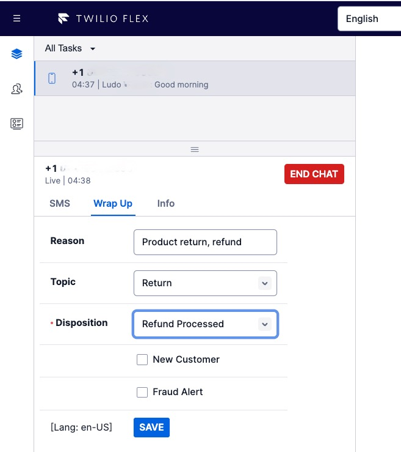

# Notice - Legacy Code

**This plugin is no longer maintained and has been updated as part of the [Flex Plugin Library](https://www.twilio.com/docs/flex/developer/plugins/plugin-library) where it is available as an out-of-box feature. The updated plugin is also available as part of the customizable [Flex Project Template](https://github.com/twilio-professional-services/flex-project-template), where it is an optional feature.**

# Wrap-Up Form with Disposition

## Your custom Twilio Flex Plugin

Twilio Flex Plugins allow you to customize the appearance and behavior of [Twilio Flex](https://www.twilio.com/flex). If you want to learn more about the capabilities and how to use the API, check out our [Flex documentation](https://www.twilio.com/docs/flex).

## How it works
This Flex plugin adds an extra tab to the TaskCanvas to capture the Reason / Topic of the conversation, the Disposition (or outcome) and additional conversation attributes.  This information is saved in the appropriate conversations attributes on the task for the benefit of [enhanced Flex Insights historical reporting](https://www.twilio.com/docs/flex/developer/insights/enhance-integration).

The agent must select (at a minimum) the Disposition value before they can Complete the task.  If no Disposition value is selected a Notification message is displayed.



This Twilio [Flex Plugin](https://www.twilio.com/docs/flex/quickstart/getting-started-plugin#set-up-a-sample-flex-plugin) leverages [Twilio Paste](https://paste.twilio.design) for the new form components on the Wrap Up tab, [React Hooks](https://beta.reactjs.org/reference/react#state-hooks) for component state management and the Flex 2.0 [useFlexSelector](https://www.twilio.com/docs/flex/developer/ui/migration-guide#useflexselector) method to subscribe to updates of the Flex Redux store

This plugin is structured to support [localization](https://www.twilio.com/docs/flex/developer/ui/v1/localization-and-templating) of the UI Strings used for the labels and form elements.   In addition to the set of English (default) strings, we also provide a sample set of Spanish (es-MX) strings for the Wrap Up Form.  When used [in conjunction](https://www.twilio.com/docs/flex/developer/plugins/cli/run-multiple-plugins) with the Twilio [PS Localization plugin](
https://github.com/twilio-professional-services/plugin-flex-localization), the Wrap Up Form should render in Spanish when the user picks Spanish from the Language selector. 

(Note: This additional localization feature is still under development and needs further refinement.)

## Setup

Make sure you have [Node.js](https://nodejs.org) as well as [`npm`](https://npmjs.com). We support Node >= 10.12 (and recommend the _even_ versions of Node). Afterwards, install the dependencies by running `npm install`:

```bash
cd 

# If you use npm
npm install
```

Next, please install the [Twilio CLI](https://www.twilio.com/docs/twilio-cli/quickstart) by running:

```bash
brew tap twilio/brew && brew install twilio
```

Finally, install the [Flex Plugin extension](https://github.com/twilio-labs/plugin-flex/tree/v1-beta) for the Twilio CLI:

```bash
twilio plugins:install @twilio-labs/plugin-flex
```

## Development

Run `twilio flex:plugins --help` to see all the commands we currently support. For further details on Flex Plugins refer to our documentation on the [Twilio Docs](https://www.twilio.com/docs/flex/developer/plugins/cli) page.


## License

[MIT](http://www.opensource.org/licenses/mit-license.html)

## Disclaimer

No warranty expressed or implied. Software is as is.


